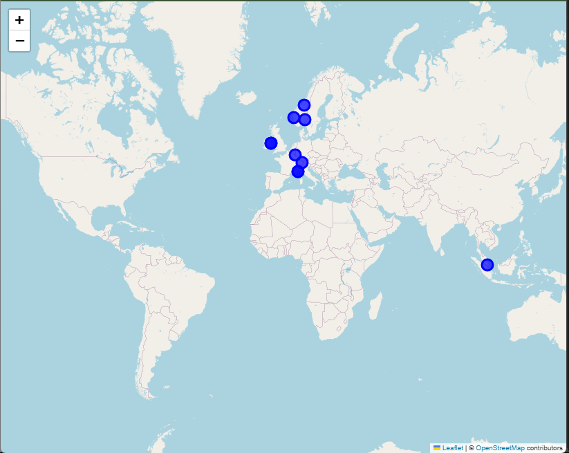
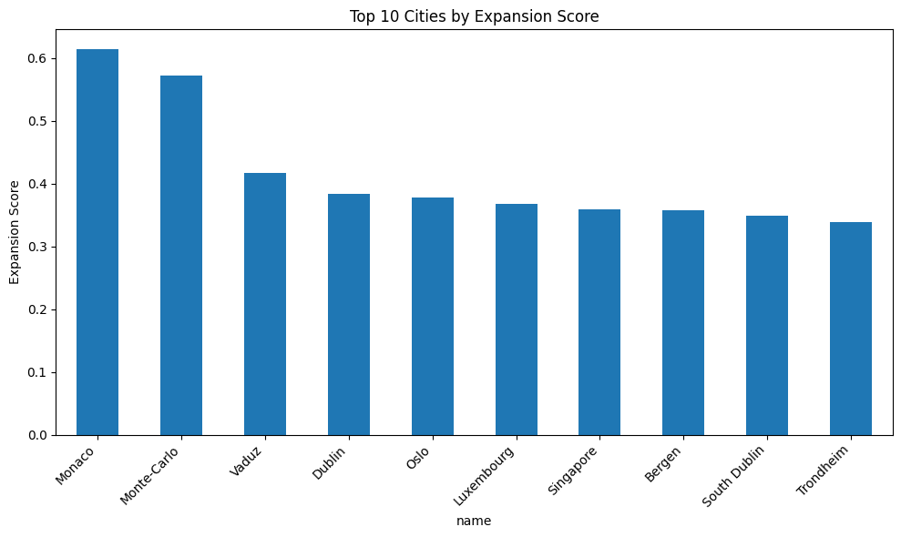

# GeoRetail AI: Predicting Top Cities for Retail Expansion Using Geospatial and Economic Data

## 1. Project Overview
Retail chains often fail in new cities due to poor site selection.  
This project uses Data Science, Geospatial Analysis, and Machine Learning to recommend optimal cities for retail expansion.

## 2. Datasets
- World Cities Database (city names, lat/lon, population)
- Economic Indicators (GDP per capita, employment rate, internet penetration)
- Population Density Data (urban vs rural)
- Retail Store Locations (existing brand presence)
- Night-Time Satellite Imagery (economic activity proxy)

## 3. Tech Stack
- Python (Pandas, NumPy)
- GeoPandas, Folium/Plotly
- Scikit-Learn, HDBSCAN
- Streamlit (optional)

## 4. Project Phases
1. Data Collection & Cleaning  
2. Exploratory Data Analysis  
3. Feature Engineering  
4. Modeling (Clustering & Classification)  
5. Visualization (Interactive Maps)  
6. Conclusion & Recommendations  
7. (Bonus) Streamlit Dashboard

## 5. Repo Structure
```
GeoRetail-AI/
├── data/            
├── notebooks/       
├── src/             
├── visuals/         
├── reports/         
├── README.md        
├── requirements.txt 
└── .gitignore       
```


## 📊 Visualizations

### Top 10 Expansion Map  
*Predicted retail expansion hotspots based on economic viability and competitive intensity.*  



### Expansion Score Bar Chart  
*Comparison of expansion scores (econ_viability × (1 – comp_intensity)) for the top 10 markets.*  


